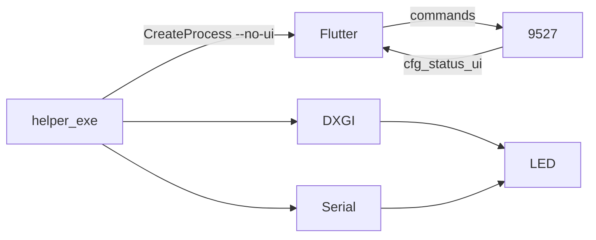

# Screen Strip Sync — 项目框架与推进规则

<!-- markdownlint-disable MD013 MD060 -->

> **唯一权威**（架构 + 红线 + 计划 + 协作）。勿另维护平行规则副本。旧 Day 日程在 `backup/cursorrules`，不作进度依据。  
> **v3**：`helper.exe` 常驻主进程（托盘 / 配置 / 串口属主）；Flutter 是可随时开关的纯前端。  
> **当前主线 · 阶段 D**：RGB 灰度硬件死区。详情 `docs/PLAN_D_rgb_deadzone.md`；底稿 `reference/serial_color_analysis_report.md`。

---

## 1. 架构 v3

| 进程 | 角色 | 做 | 禁止 |
|------|------|----|------|
| `helper.exe` | 常驻主进程 | 单实例、托盘、读写 JSON、串口、DXGI、采样组帧、发帧、IPC、自启、电源自恢复、按需拉 UI | 对外监听、多客户端、因前端退出而关灯/退进程 |
| `screen_strip_sync.exe` | 纯前端 | UI、发命令、渲染 cfg/status、框选校准 | 写配置、开串口、像素热路径、杀 helper、Dart 侧 EMA/组帧 |

IPC：`127.0.0.1:9527`，只传命令/状态/配置文本；像素与发帧全在 helper。

| 场景 | 流程 |
|------|------|
| 正常启动 | helper → 托盘 → 读配置 → 试开串口（失败也常驻）→ listen → 拉 Flutter |
| 静默自启 | `helper.exe --autostart`：同上，**不拉** Flutter |
| 打开界面 | 有客户端 → `ui show`；否则 CreateProcess Flutter |
| 隐藏界面 | Flutter X → `bye` → `exit(0)`；helper/灯不受影响 |
| 完全退出 | 托盘「退出」/`quit` → 有客户端先 `ui quit` → 关灯 → 停引擎 → 关串口/DXGI → 摘托盘 → 退进程 |

废案勿回：v1 同进程 FFI；v2 Flutter 主进程拉 helper。

---

## 2. 硬红线

- **设备**：米家追光灯带 Pro，20 珠 / 10 段 / Step=2；ASCII 串口 **230400 8N1**，帧以 `\r\n` 结尾。
- **RGB 死区**：灰阶 &lt; `T` 时硬件**直接灭**（不是很暗）。须跃阶起步 / 迟滞灭灯 / 非对称平滑；禁止死区内假渐变。`T` 与 `near_black`、BRT=`63` **三者独立**（D0 实测）。
- **帧长**：含 `\r\n` **&lt; 120**（`serial_port.cpp` / `engine_frame.cpp` 校验）；设备硬上限 128 无保护，**绝不试探**。与 IPC 行长 512 **无关**。
- **帧间隔**：`WriteFile` 后 **Sleep ≥ 50ms**；不可压低。
- **并发**：串口写统一 `send_one_frame` 互斥（成功后仍持锁 Sleep）；停引擎：置停 → join → power_off → 关串口。
- **进程**：串口属主 = helper；互斥体 `Global\ScreenStripSyncHelper` / `Local\ScreenStripSyncUi`；断客户端不关灯；Flutter 兜底拉 helper 须先试连 9527 且带 `--no-ui`；`--autostart`/`--no-ui` **永不**拉 UI。
- **配置**：写方唯一 = helper；帧长/50ms **不可配置**；IPC/JSON 数值 helper 侧 clamp；debounce 写盘，禁热路径写文件。

---

## 3. 代码框架

**helper（`cpp_core/`）** — `#include` 扁平；废案/backup 不编入。

| 目录 | 职责 |
|------|------|
| `app/` | WinMain、生命周期、日志 |
| `config/` | JSON 属主、clamp、开机自启注册表 |
| `capture/` | DXGI map / region 采样 |
| `shell/` | 托盘+电源、UI 拉起、资源 |
| `ipc/` | accept / push / dispatch |
| `engine/` | 参数、串口、组帧循环、intent、墙补；**D 死区后处理待重写** |

**Flutter（`lib/`）**：`main` → `app/` → `ui/pages|widgets` → `state/` → `ipc/` → `config/`（只读模型 + cfg 解析）。校准在「灯光方案 → 屏幕跟色」；氛围用「划定取色区域」。

---

## 4. 前端约定

- UI：Material 3；自绘顶栏/侧栏；**不用** `fluent_ui`。
- 状态：`flutter_riverpod` 的 `Notifier`（禁 legacy `StateNotifier`/`StateProvider`）；副作用只在 Notifier / `onDispose`。
- 配置：`AppConfig` 只读 + `fromCfgLines`；等 `cfg …` + `cfg end` 再渲染。
- 路径：exe 同目录优先，回退开发 `build\…` / `cpp_core\build\Release\`；**禁止绝对路径**。

---

## 5. IPC（一行一条，`\n`；&gt;512 丢到行尾）

### Flutter → helper

| 命令 | 含义 |
|------|------|
| `sync` | 要全量快照 |
| `start` / `start_region` / `stop` | map 追色 / region 氛围 / 停 |
| `solid RRGGBB` / `soft_off` / `off` | 纯色 / 软关（黑帧）/ 真下电 |
| `bye` / `quit` | 断连接（灯保持）/ 关后台服务 |
| `reconnect` | 重开串口 |
| `set alpha\|near_black\|near_black_luma\|blur\|saturation\|saturation_algo\|sample_algo …` | map 参数（clamp；`saturation_algo` 为 `luma\|neutral`；`sample_algo` 为 `rms\|mean`；`near_black_luma` 为 `rec601\|mean`） |
| `set mode a\|b` | **废弃**，仅存盘兼容 |
| `set com\|sleep_sync\|shutdown_off\|autostart …` | 口/休眠/关机关灯/自启 |
| `highlight n` / `set map …` | 校准高亮 / 段映射 |
| `set region_algo\|blur\|smooth\|dark\|bbox …` | 氛围参数 |
| `set capture_output …` / `set last_custom_solid …` | 抓屏 / 自定义纯色 |
| `set letterbox_detect 0\|1` | 智能忽略电影黑边（与 `near_black` 正交） |
| `set letterbox_hold 0\|1` | 校准硬关 letterbox（不落盘） |

`set` 后 debounce 写盘；场景命令更新 `lastScene`。

### helper → Flutter

| 推送 | 含义 |
|------|------|
| `cfg …` / `cfg end` | 配置快照；`end` 后 UI 才可渲染 |
| `cfg scene …` / `cfg map …` | 场景与映射 |
| `status ready\|com\|engine\|display\|…` | 运行状态；`outputs`/`output` 为屏枚举 |
| `status serial_lost\|ok` | **暂缓**，勿新做 |
| `ui show` / `ui quit` | 置顶窗口 / 后台退出，Flutter 立刻 `exit(0)` |

**map**：无表→顶边均分；有表→矩形采样 + `near_black`（`near_black_luma`=`rec601`/`mean`）+ `sample_algo`（`rms`/`mean`）+ blur；可选 `letterbox_detect` 将 Y 映射进内容窗。百分比相对**被 duplicate 的屏**。  
**region**：bbox 竖切 10 段；mean/max + blur/smooth/dark；同样可套 letterbox Y 映射。

### JSON（`%LocalAppData%\Screen Strip Sync\screen_strip_sync_config.json`）

`emaAlpha` / `nearBlack` / `nearBlackLuma` / `blurStep` / `saturation` / `saturationAlgo` / `sampleAlgo` / `mode`(废) / `comPort` / `lastConnectedCom` / `captureOutput` / `autoSleepSync` / `turnOffOnShutdown` / `startOnBoot` / `segmentMap` / `regionAlgo|Blur|Smooth|Dark|BBox` / `lastScene` / `lastCustomSolid` / `letterboxDetect`。缺字段回退默认；老文件须能直接读。

---

## 6. 推进计划

取**第一项未勾选**；一次一小步。

### 阶段 D — RGB 死区（当前主线）

口径：**跳过死区过渡；回死区真灭**。不改 BRT=`63`；不做默认底光；不搬 HyperHDR 整套。

- [x] **D0** 实测 `T`（SSCOM 蓝通道扫灰，BRT 仍 63）→ 写 `PLAN_D`「实测记录」；`T=1` / `T_on=1` / `T_off=0`
- [ ] **D1** 独立判定信号 + 宽迟滞 + 双向确认 + 最短驻留 400ms（已实现，以后可能会改）；0.49 保持 — 实机验收中
- [ ] **D2** 非对称平滑（`α_up`/`α_down`；region 等价映射）；先内部常量
- [ ] **D3** 伽马（可选；无效则删）

### 已归档完成

H1–H8、F1–F4、A、B4、M、C3（DXGI 自愈）、X3。C1/C2 亮度 A/B **废弃**。P / X1–X2 不阻塞主线。

---

## 7. 产品债与诊断

1. **BRT 写死 `63`**：已知取舍；报「α 无效 / 硬切」先说明这点，勿当回归去「修」。
2. **RGB 死区（D）**：对称 EMA + 硬件截断 → 暗闪/啪亮/灭不净；D1 待重写，勿先怪 DXGI/线程。
3. **COM 掉线**：仅 IPC `reconnect`；自动重连暂缓。

| 路径 | 入口 | 要点 |
|------|------|------|
| map | `start` | 段映射或顶边；α / near_black / near_black_luma / blur / sat / saturation_algo / sample_algo；**+ D** |
| region | `start_region` | bbox；algo/blur/smooth/dark；**+ D** |

---

## 8. 协作纪律

- 学习节奏：概念 → 代码 → 验收；**每次一小步**；回复：**目标 → 对照 → 验收**。
- C++ 热路径少拷贝；注释写「为什么」。Flutter 说明谁 watch / 状态在哪。
- 静态检查用 `dart analyze` / IDE，**勿默认** `user-dart` 的 `analyze_files`（易卡住）。
- 改 C++：`cmake --build cpp_core/build --config Release`。
- 优先级：前债 → 红线（含死区假渐变）→ 已知妥协勿当 bug。
- 排查序：帧长 → 50ms → 互斥 → join 顺序 → stride → 单实例 → IPC/helper 存活 → COM 占用 → 配置写方 → **死区** → 采样调度。
- **Git**：禁止 commit 中出现 Codex agent / `cursoragent` / `Co-authored-by: Codex …`；勿 `--no-verify`。见 `docs/git-no-cursoragent.md`、`.githooks/`。
