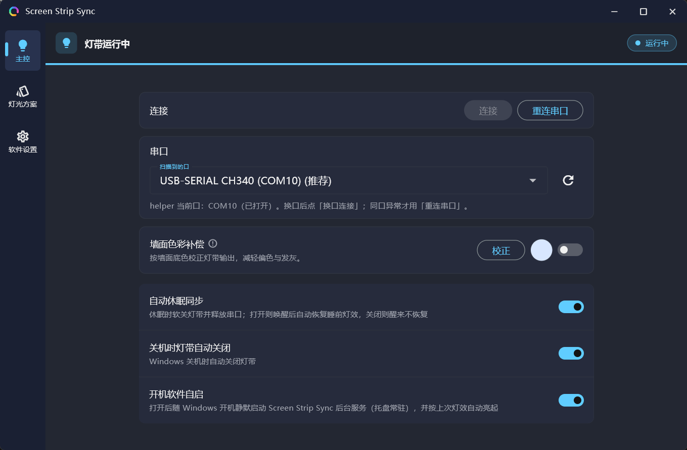
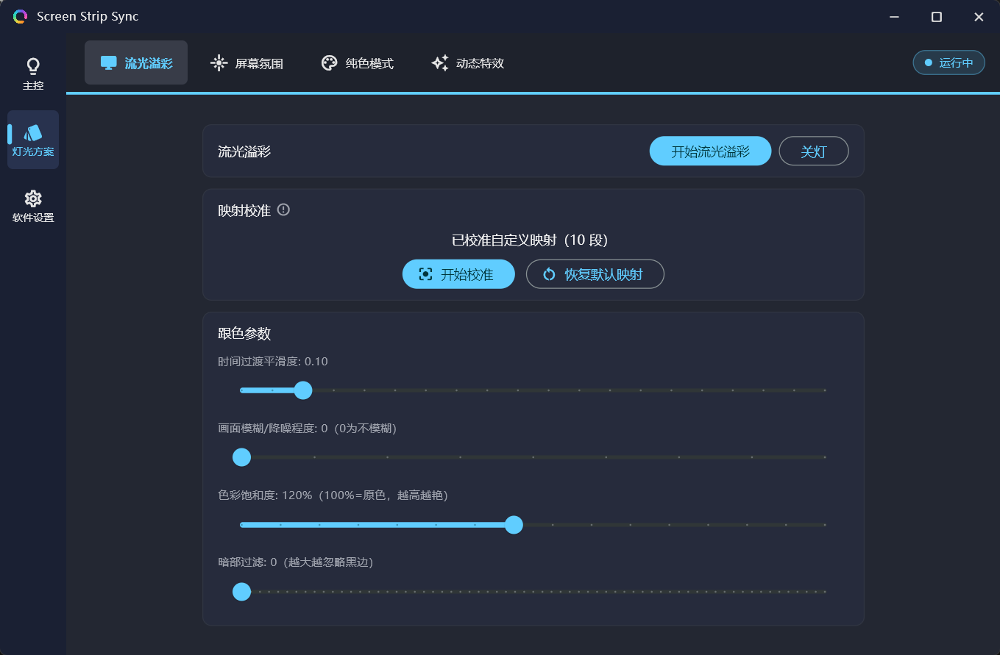
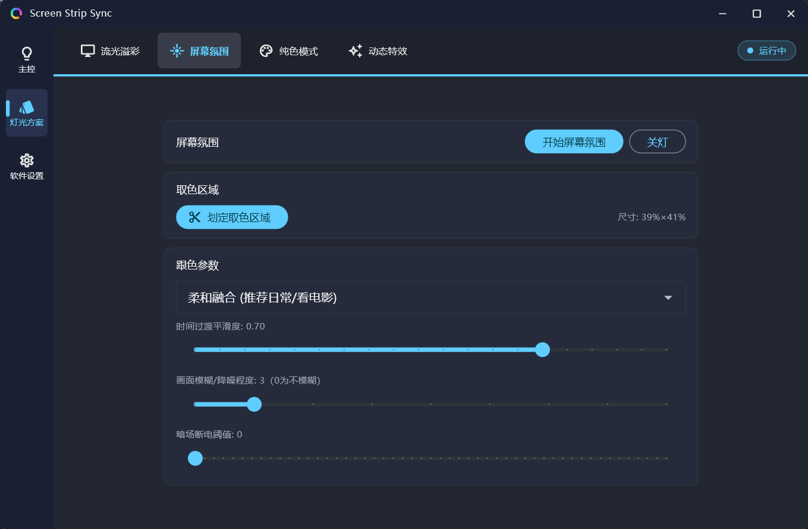
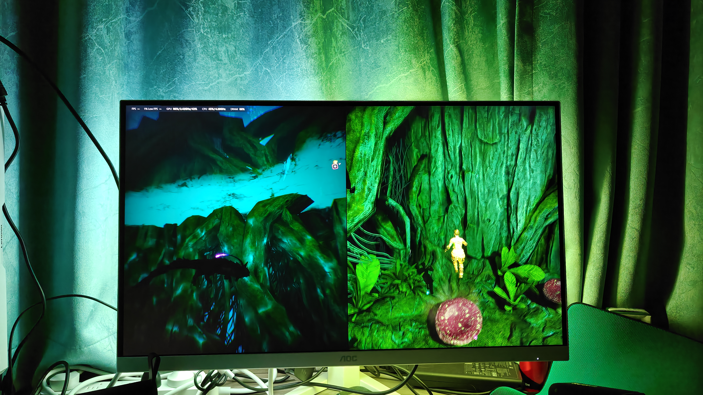
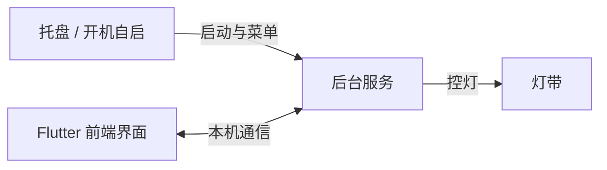

<!-- markdownlint-disable MD033 MD041 -->
<div align="center">


# Screen Strip Sync

**为米家追光氛围灯带定制的非官方上位控制系统**（Windows）

面向 **米家追光氛围灯带**（对外亦称米家追光灯带 Pro，非官方）的 PC 屏幕同步控灯：把显示器画面颜色同步到 USB 串口灯带。常驻 **Screen Strip Sync 后台服务**（托盘 + 抓屏 + 串口发帧）；设置界面可随时开关，**关掉界面灯不会灭**。

[English](./README.en.md) · [串口通信协议](./reference/灯带串口通信协议.md) · [IPC](./reference/进程间IPC协议.md) · [本项目注意事项](./reference/项目注意事项与踩坑.md)

</div>
<!-- markdownlint-enable MD033 MD041 -->

---

## 声明

- 本项目为个人二次开发的**非官方上位控制系统**，专为 **米家追光氛围灯带** 定制，**不是**厂商官方软件。
- 与小米、米家、Signify、飞利浦等品牌**无关联**；相关商标归其权利人所有。
- 设备对外写作：**米家追光氛围灯带 / 米家追光灯带 Pro（非官方）**。请勿把电商第三方俗称当成正式产品名宣传。
- 串口协议来自 Device Monitoring Studio 抓包与黑盒测试，仅在固件 **`2.1.8_0039`** 上验证；其它固件 / 型号**不保证**兼容。
- 帧过长可能导致灯带固件死机（需断电重启）。自行改协议请先阅读 [串口协议](./reference/灯带串口通信协议.md) 中的长度与间隔限制。

---

## 它能做什么

- **屏幕跟色（流光溢彩）**：按段采样屏幕边缘（或自定义矩形），驱动灯带跟随画面
- **屏幕氛围**：在划定区域内取色，整块氛围光
- **纯色 / 软关灯**：一键设色；关灯默认「画黑不掉电」，随时可再亮
- **托盘常驻**：开机自启、休眠与息屏同步（可选）、关掉设置界面灯仍可亮
- **段映射校准**：逐段框选采样区域，对齐你的灯带安装位置

### 界面预览







### 实拍效果



---

## 使用（安装包 / 成品目录）

Release 成品在仓库的 **`dist_installer/`** 目录（发布到 GitHub Release 时也用这里的文件），主要包括：

| 文件 | 说明 |
| --- | --- |
| `ScreenStripSync-*-windows-x64-Setup.exe` | Inno 安装包（**推荐**） |
| `ScreenStripSync-*-windows-x64.zip` | 绿色版：解压后运行后台服务即可 |
| `SHA256SUMS.txt` | 校验和 |

当前仅提供 **Windows x64**。Flutter 桌面端没有可用的 x86 工具链，本项目也无法产出 32 位安装包。

这是**没有代码签名**的个人小项目。安装或首次运行时，Windows 可能提示「未知发布者」，部分杀毒软件也可能误报。若你信任本仓库源码，可在系统提示中选择仍要运行 / 加入白名单；不放心请自行从源码编译。

### 第一次怎么开

1. 安装包：按向导安装后，从开始菜单启动；或绿色版：解压后运行 **Screen Strip Sync 后台服务**（不要只双击前端界面当唯一入口）
2. 托盘出现图标后，会按需拉起界面；也可托盘菜单打开
3. 在设置里选择正确的 **COM 口**，必要时点重连
4. 在灯光方案里选择「流光溢彩」或「屏幕氛围」等

### 开机自启

在设置中打开开机自启后，会注册 **后台服务** 随系统静默启动（默认不弹界面）。  
开始菜单 / 桌面快捷方式也应指向 **后台服务**。

---

## 环境要求

- **操作系统：Windows 10 / 11 x64**
- **Flutter SDK：3.12.2 及以上**
- **Dart SDK：随 Flutter 一起安装**
- **CMake：3.10 及以上**
- **Visual Studio 2022：**
  - Desktop development with C++
  - Windows 10 / 11 SDK
- **可选：Inno Setup 6**（用于打包安装程序）
- 已连接的灯带

从源码编译时还需要：
- [Flutter](https://flutter.dev/)（Windows desktop）
- CMake + MSVC（编译 `cpp_core`）
- 可选：[Inno Setup 6](https://jrsoftware.org/isinfo.php)（打安装包）

---

## 架构一览

| 对外叫法 | 做什么 |
| --- | --- |
| **Screen Strip Sync 后台服务** | 常驻主程序：托盘、配置、抓屏、控灯 |
| **Flutter 前端界面** | 调参、发命令、框选校准；关掉也不影响灯 |

Flutter 前端界面和后台服务之间只传**命令 / 状态 / 配置文字**，不传画面像素。抓屏与发灯在后台服务内部完成。



### 关界面 ≠ 关灯

| 动作 | 结果 |
| --- | --- |
| 关掉 Flutter 前端界面 | 窗口退出；**灯继续，后台服务继续** |
| 界面「关灯」 | **软关**：灯看起来灭了，但不断开连接，随时可再亮 |
| 托盘「退出」 | 真下电并退出后台服务 |

---

## 从源码构建

```powershell
# 1. 编译 helper
cmake --build cpp_core/build --config Release

# 2. 编译 Flutter 界面
flutter build windows --release

# 3.（可选）打安装包：产物输出到 dist_installer/
powershell -ExecutionPolicy Bypass -File packaging/pack.ps1
```

开发时大致路径：

| 产物 | 常见位置 |
| --- | --- |
| 后台服务 `helper.exe` | `cpp_core/build/Release/helper.exe` |
| 设置界面 `screen_strip_sync.exe` | `build/windows/x64/runner/Release/screen_strip_sync.exe` |

正式分发时两者应在**同一目录**。

---

## 目录结构（简要）

```text
screen_strip_sync/
├── lib/                 # Flutter 界面
├── cpp_core/            # helper.exe（C++）
│   ├── app/             # 入口、生命周期、日志
│   ├── capture/         # DXGI 抓屏
│   ├── engine/          # 组帧、串口、发帧循环
│   ├── ipc/             # 本机 IPC
│   ├── config/          # 配置读写
│   └── shell/           # 托盘、拉起 UI
├── reference/           # 协议与注意事项（给第三方 / 贡献者）
├── packaging/           # Inno 安装脚本
└── assets/              # 图标等
```

仓库中标注「废案」的同进程 FFI 目录仅为历史参考，**不是**当前控灯主线。

---

## 文档

| 文档 | 内容 |
| --- | --- |
| [灯带串口通信协议](./reference/灯带串口通信协议.md) | PC ↔ 灯带 ASCII 协议、帧长 / 间隔红线、软关 vs 真下电 |
| [进程间 IPC 协议](./reference/进程间IPC协议.md) | 界面 ↔ helper 文本命令与配置字段 |
| [注意事项与常见坑](./reference/项目注意事项与踩坑.md) | 架构演进、排障顺序、实现雷区 |

---

## 反馈问题

1. 在界面打开 **设置 → 导出诊断信息**（会在桌面生成 `screen_strip_sync_diag_*.txt`，仅本地，不上传）
2. 用仓库的 Bug report 模板开 Issue，并附上该文件
3. 同页可打开后台服务日志目录（`helper.log` 一般在 `helper.exe` 旁）

请勿把整屏截图塞进诊断流程；导出内容主要是配置、状态与日志尾部。

---

## 已知限制（摘录）

- 渲染帧全局亮度字段当前**固定为 `63`**（约 99%）；观感明暗主要跟该字段有关
- 串口帧工程上限 **&lt; 120 字节**；约 **130 字节** 压测会死机
- 发帧间隔 **≥ 50 ms**（再短易丢帧）
- COM 掉线自动重连能力有限，多依赖界面「重连」
- 仅在作者测试过的设备与固件上验证；其它型号请自行验证

更完整的坑点见 [注意事项与常见坑](./reference/项目注意事项与踩坑.md)。

---

## 鸣谢

部分思路参考了开源项目 [HyperHDR](https://github.com/awawa-dev/HyperHDR)（电影黑边检测、暗场抗闪等），在此致谢。本软件为独立实现，与 HyperHDR 无隶属关系。

---

## 许可证

本项目采用 [Apache License 2.0](./LICENSE)。
