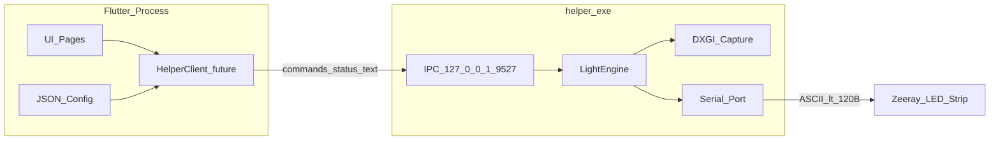

# Zeeray AI 状态说明（现状 / 下一步）

> **面向读者**：后续接手的 AI 助手。  
> **信息来源**：[`docs/PROJECT_STATUS.md`](PROJECT_STATUS.md)、[`cursorrules`](../cursorrules)、当前仓库代码。  
> **最后对齐**：2026-07-27

---

## 1. TL;DR（给 AI 的一分钟摘要）

- **项目**：Windows 平台 PC 屏幕同步氛围灯驱动（米家追光灯带 Pro / Zeeray，20 段物理 RGB）。
- **架构 v2（双进程）**：
  - **Flutter (Dart)**：只做 UI、模式切换、JSON 配置、EMA / 调色方案参数展示与编辑。
  - **`helper.exe` (C++)**：串口唯一属主、DXGI 抓屏、stride 采样、组 ASCII 帧、发帧循环。
- **IPC**：`127.0.0.1` 回环 TCP，**只传命令 / 状态文本**；逐帧像素与发帧热路径全部留在 helper，**不再经 `dart:ffi`**。
- **当前状态**：
  - **Helper 后端基本就绪**：串口、引擎、DXGI、IPC、基本生命周期已有。
  - **Flutter 仅有 IPC 烟测台**（[`lib/main.dart`](../lib/main.dart)）：能拉起 helper、连 Socket、发 `solid` / `start` / `stop` 等；**尚无产品级 UI、JSON 配置页、方案 A/B 控件**。
- **当前工作重心**：**先做前端壳与交互**（阶段 A）；IPC 正式整合与调参下发放到前端成型后再做（阶段 B）；亮度方案 A/B 与 helper 缺口放在最后（阶段 C / Day25 总修）。
- **进度推断（勿写死 Day 数字）**：对照 `cursorrules` 每日 build/accept 与仓库实现，Helper 侧约 Day 19–24 能力已具备大部分；Flutter 产品化与部分生命周期项仍欠；**第一个未完成项 ≈ 阶段 A1（前端 App 壳）**。

---

## 2. 架构与红线（任何实现不得突破）

### 2.1 双进程边界

| 进程 | 职责 | 禁止 |
|------|------|------|
| Flutter | UI、模式切换、JSON、EMA / 方案参数 | 直接开串口、传逐帧像素、走发帧热路径 |
| `helper.exe` | 串口、抓屏、采样、组帧、发帧、IPC 服务 | 对外监听、多连接、让 Flutter 碰 COM |

- helper 须随 App 退出而**干净退出**：关灯 → 停线程 → 关串口 → 进程退出；防僵尸占 COM。
- IPC 绑定 `127.0.0.1`、只 accept **单连接**，不对外监听。

### 2.2 硬件与串口红线

- **设备**：米家追光灯带 Pro，20 颗物理 RGB。
- **协议**：纯 ASCII 文本串口，**230400 8N1**，每帧必须以 `\r\n` 结尾。
- **帧长**：含 `\r\n` 工程限制 **< 120 字节**（代码层拒绝 `>=120`）；设备硬上限 128，**无防溢出**，超限死机需硬件重启。10 段渲染、Step=2。
- **帧间隔**：`WriteFile` 后 **Sleep ≥ 50ms**（实测极限；再短丢帧）。不得为提高帧率压到 50ms 以下。
- **串口写**：必须互斥（`std::mutex`），含关灯路径。

### 2.3 历史废案（勿回改主线）

- Day 1–14：同进程 Flutter + C++ DLL + `dart:ffi` 已验证可控灯，但窗口可见时与 Flutter 渲染抢资源丢帧。
- Day 15 起切双进程 + IPC；DLL 与 `lib - 副本/` 为学习产物，**控灯主线是 `helper.exe`**。

---

## 3. 当前实现（按组件）

### 3.1 Helper（`cpp_core/`）

| 模块 | 状态 | 关键文件 / 说明 |
|------|------|-----------------|
| 串口 | ✅ | `serial_port.cpp`：`CreateFile`、230400 8N1、超时/Purge；`send_one_frame` 互斥 + 帧长校验拒绝 `>=120` |
| 灯引擎 | ✅ | `light_engine.cpp`：握手 / 纯色 / 氛围灯后台循环（DXGI 采样 → RGB EMA → 组 ASCII 帧 → 互斥写 + Sleep 50ms） |
| DXGI 抓屏 | ✅ | `dxgi_capture.cpp`：Desktop Duplication、stride 采样、10 段边缘、blurStep 水平平均 |
| IPC 服务 | ✅ | `ipc_loop.cpp`：Winsock 监听 `127.0.0.1:9527`，按行解析命令，可回传 `status …` |
| 生命周期 | ⚠️ 部分 | `helper_main.cpp`、`helper_lifecycle.h`、`power_watch.cpp`：Ctrl-C / 关控制台 / 休眠 / 注销等走 `helper_shutdown`；**缺父进程 PID 监测、IPC 断连后重回 listen** |
| 入口 | ✅ | `helper_main.cpp` |

### 3.2 Flutter（活跃树）

| 模块 | 状态 | 说明 |
|------|------|------|
| IPC 烟测 | ✅ | [`lib/main.dart`](../lib/main.dart)：`Process.start` 拉起 helper → Socket 连接 |
| 按钮 | ✅ | 连接 / 红（`solid`）/ 开始 / 停止 / 重连；唤醒后杀 helper 再重连 |
| 产品 UI | ❌ | 无导航壳、无主控/设置分页、无 JSON 持久化、无方案 A/B 控件 |
| 旧代码 | 废弃 | `lib - 副本/`：旧导航壳 + FFI 废案，**未接入活跃 `lib/`** |

### 3.3 IPC 命令协议（helper 当前已支持）

一行一条，建议 `\n` 结尾。未知命令：helper 打日志并忽略，不崩；超长行丢弃。

| 方向 | 文本 | 含义 |
|------|------|------|
| → helper | `start` | 启动氛围灯引擎线程 |
| → helper | `stop` | 停止引擎 |
| → helper | `solid RRGGBB` | 发一帧纯色（6 位 hex） |
| → helper | `off` | 停引擎并关灯 |
| → helper | `quit` | 停引擎并结束 IPC 循环（helper 退出） |
| → helper | `reconnect` | 关串口并重试就绪 |
| ← helper | `status ready` | 连接后就绪 |
| ← helper | `status reconnecting` | 正在重连串口 |
| ← helper | `status reconnect_ok` | 重连成功 |
| ← helper | `status reconnect_fail` | 重连失败 |

**尚未实现**：EMA α、方案 A/B、校正增益等配置类 IPC 命令——阶段 B 可先写接口草稿，再改 C++。

---

## 4. 未解决 / 产品债（风险点）

### 4.1 亮度模型（Day25 总修，Day22–24 勿擅自改）

- **事实**：`set_rgb_pc` 的 `{Brightness}`（如 `63`）是**全局亮度**（hex≈百分比；`63`≈99%，`01`≈1%）。观感明暗主要跟 Brightness；固定亮度下改 RGB 灰阶，灯上几乎只有全亮/全黑。
- **当前实现**：Brightness **写死 `63`**，仅对 RGB 做 EMA → 软件 α 对灭灯渐变**几乎不可见**。
- **诊断纪律**：若用户报「α 无效 / 硬切亮灭」，**先提示 BRT 仍写死 63、明暗主通道未接**，勿误判为超时/采样/调度 bug。

### 4.2 双调色方案（均未落地，Day25 统筹）

| 方案 | 定位 | 要点 |
|------|------|------|
| **A — 简单跟色（默认）** | 开箱即用 | 高亮度 + RGB 跟屏色；接受亮↔黑较硬切；UI 少选项 |
| **B — 暗场/亮度调色（可选）** | 进阶用户 | luma → Brightness（`01`～`63`）+ 亮度 EMA；RGB 主跟色相；可选 R/G/B 增益或伽马、亮度上限；须经 Flutter JSON + IPC 下发，**禁止写死唯一魔法数** |

产品原则：两套可切换；默认方案 A，方案 B 为可选。

### 4.3 Helper 缺口

- 无父进程 PID 监测（Day18 验收项部分欠）
- DXGI `ACCESS_LOST` 未自动恢复
- COM 失败后无自动重连（仅 IPC `reconnect` 手动触发）；COM 口写死
- EMA / 采样 / blur 不可经 IPC 配置
- IPC 断连后不重回 listen

### 4.4 前端缺口

- 产品 UI、模式切换、JSON 配置页、状态面板
- helper 相对路径打包（当前开发用绝对路径）

---

## 5. 下一步（按阶段推进）

**用法**：从上往下取**第一项未勾选**的做；一天一事，不必赶多项。会了的可跳过。

### 阶段 A — 前端壳（**当前优先，可暂不碰真灯**）

- [ ] **A1** App 壳：导航（主控 / 设置），拆出页面文件，告别单文件烟测堆叠。
- [ ] **A2** 主控页布局：开始 / 停止、纯色、关灯、连接状态占位（先本地 `setState`，不强制 helper）。
- [ ] **A3** 设置页骨架：EMA α、方案 A/B 切换入口（绑本地变量即可；先不落盘）。
- [ ] **A4** JSON 配置读写：本地存/读上述参数；启动恢复上次选择。
- [ ] **A5** 状态与反馈：连接中 / 就绪 / 失败 / 引擎运行中的文案与简单视觉反馈。
- [ ] **A6** UI 打磨一小步：间距、禁用态、基础动效（可选，克制）。

### 阶段 B — 接 IPC（前端成型后再做）

- [ ] **B1** 抽出 `HelperClient`（启动进程、Socket、按行收发）；主控按钮改调客户端；helper 路径改为相对/可配置，去掉硬编码绝对路径。
- [ ] **B2** 对齐现有命令：`start` / `stop` / `solid` / `off` / `quit` / `reconnect` + 解析 `status …`。
- [ ] **B3** 生命周期：退出发 `quit`；唤醒重连；确认无僵尸 helper（把烟测逻辑迁入正式壳）。
- [ ] **B4** 配置下发：JSON 变更经 IPC 传到 helper（若尚无命令，先记接口草稿，再改 C++）。

### 阶段 C — 产品债与收尾（前端 + IPC 稳后再做）

- [ ] **C1** 方案 A 默认通路确认（高 BRT + RGB 跟色）。
- [ ] **C2** 方案 B：luma → Brightness + 亮度 EMA；设置页校正滑条真正生效。
- [ ] **C3** Helper 缺口按需：COM 可配 / 自动重连、父进程监测、DXGI 恢复等。
- [ ] **C4** 全路线对照：红线复查 + 打包（helper 与 App 同目录）。

---

## 6. AI 协作纪律

### 6.1 角色与节奏

- 你是**学习助手**：用户采用「先学概念 → 再写代码 → 再验收」；每次只推进一小步。
- 回复结构：**本步目标 → 必要代码/对照 → 一句验收**。禁止一次铺开多天。
- 给 Flutter UI 代码时，**简要说明 Widget 树与状态管理**（开发者在边做边学）。

### 6.2 执行优先级

1. **前债不可欠**：发现 Day 1..N-1 缺项或与红线不符，先修再继续。
2. **红线立刻改**：帧长、节流、mutex、线程退出顺序、stride、IPC 断连、僵尸 helper 等。
3. **例外**：Brightness 写死 `63` / 亮度模型 → **仅 Day25（阶段 C）总修**，Day22–24 不得擅自改。
4. **稳定性排查顺序**：帧长 → 节流 → mutex → 线程退出 → stride → IPC/进程生命周期 → 再查采样；「α 无效」先查 BRT。

### 6.3 前端职责边界

| 做 | 不做 |
|----|------|
| UI 交互、模式切换、JSON 读写、EMA / 方案参数 | 网络请求、复杂路由、直接开串口、逐帧像素热路径 |

### 6.4 C++ 代码规范

- 热路径少拷贝；业务核心注释解释「**为什么**」而非仅「做了什么」。
- FFI 结构体（若涉及）须标注内存对齐与所有权。

---

## 7. 关键文件索引

```
zeeray_ambilight/
├── lib/main.dart              # Flutter 活跃入口（当前=IPC 烟测台）
├── lib - 副本/                # 旧 UI + FFI 废案（勿当主线）
├── cpp_core/
│   ├── helper_main.cpp        # helper.exe 入口
│   ├── ipc_loop.cpp           # IPC 监听与命令解析
│   ├── light_engine.cpp       # 引擎：采样→EMA→组帧→发帧
│   ├── dxgi_capture.cpp       # DXGI Desktop Duplication
│   ├── serial_port.cpp        # 串口封装
│   ├── power_watch.cpp        # 休眠/注销等信号
│   └── helper_lifecycle.h     # 退出顺序
├── docs/PROJECT_STATUS.md       # 人类可读项目现状（与本文件互补）
└── cursorrules                  # 完整 Day 计划与红线（教学用）
```

---

## 8. 架构示意



---

*本文档随项目推进更新；详细人类向说明见 [`PROJECT_STATUS.md`](PROJECT_STATUS.md)，完整教学日程见 [`cursorrules`](../cursorrules)。*
