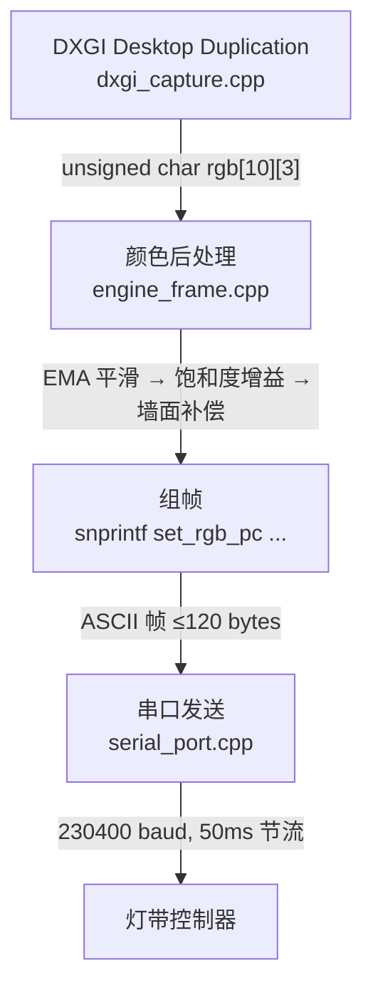
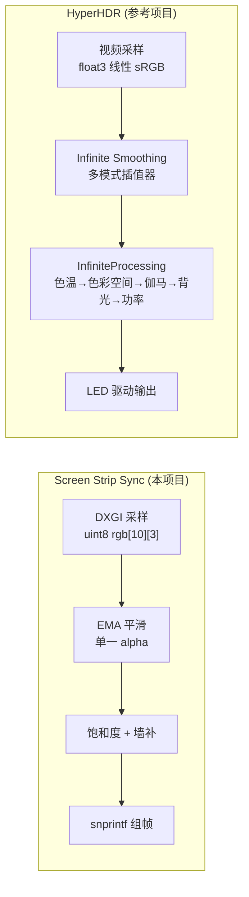
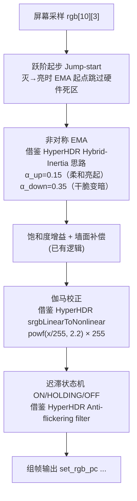

# Screen Strip Sync — 串口取色逻辑分析与暗部优化报告

> **来源对话**: [串口取色逻辑分析](conversation://9fccad1a-7ef4-439e-848e-ed6040e82b60)
> **本项目**: [Screen Strip Sync](file:///C:/Users/svip7/.gemini/antigravity/worktrees/zeeray_ambilight/serial_color_analysis_report) — 为米家追光氛围灯带定制的非官方 PC 上位控制系统
> **引用项目**: [awawa-dev/HyperHDR](https://github.com/awawa-dev/HyperHDR) — 下一代开源氛围灯系统，高精度浮点色彩管线，突破传统 RGB 24-bit 限制
> **日期**: 2026-09-20 ~ 2026-09-22

---

## 一、项目背景

### 1.1 本项目 — Screen Strip Sync

面向 **米家追光氛围灯带** 的 Windows 桌面应用，将显示器画面颜色实时同步到 USB 串口灯带。

| 组件 | 技术栈 | 职责 |
|---|---|---|
| **后台服务** `helper.exe` | C++ (DXGI + Win32 串口) | 常驻托盘、抓屏、组帧、串口发帧 |
| **设置界面** | Flutter Windows Desktop | 用户调参、段映射校准 |

#### 关键源文件

| 文件 | 核心职责 |
|---|---|
| [engine_frame.cpp](file:///C:/Users/svip7/.gemini/antigravity/worktrees/zeeray_ambilight/serial_color_analysis_report/cpp_core/engine/engine_frame.cpp) | ⭐ 主帧循环、EMA 平滑、饱和度增益、组帧输出 |
| [dxgi_capture.cpp](file:///C:/Users/svip7/.gemini/antigravity/worktrees/zeeray_ambilight/serial_color_analysis_report/cpp_core/capture/dxgi_capture.cpp) | DXGI Desktop Duplication 抓帧 + Map 路径采样 |
| [dxgi_region.cpp](file:///C:/Users/svip7/.gemini/antigravity/worktrees/zeeray_ambilight/serial_color_analysis_report/cpp_core/capture/dxgi_region.cpp) | Region 路径整块区域采样 |
| [serial_port.cpp](file:///C:/Users/svip7/.gemini/antigravity/worktrees/zeeray_ambilight/serial_color_analysis_report/cpp_core/engine/serial_port.cpp) | 串口 open/write/read/close，230400 baud 8N1 |
| [engine_serial.cpp](file:///C:/Users/svip7/.gemini/antigravity/worktrees/zeeray_ambilight/serial_color_analysis_report/cpp_core/engine/engine_serial.cpp) | 握手序列、send_solid、send_highlight |
| [wall_comp.cpp](file:///C:/Users/svip7/.gemini/antigravity/worktrees/zeeray_ambilight/serial_color_analysis_report/cpp_core/engine/wall_comp.cpp) | 墙面颜色补偿 |
| [engine_internal.h](file:///C:/Users/svip7/.gemini/antigravity/worktrees/zeeray_ambilight/serial_color_analysis_report/cpp_core/engine/engine_internal.h) | 引擎内部共享状态 |

### 1.2 引用项目 — HyperHDR

**[awawa-dev/HyperHDR](https://github.com/awawa-dev/HyperHDR)** 是 Hyperion.ng 的最强衍生分支（MIT License），由 `awawa-dev` 维护。其核心特性：

- **Infinite Color Engine (ICE)** — v22 引入的高精度浮点色彩管线，突破传统 8-bit 整数处理的累积舍入误差
- **Hybrid-Inertia 混合惯性平滑** — 基于弹簧-阻尼物理模型的 YUV 空间插值器
- **Anti-flickering filter** — 专门解决 8-bit LED 驱动芯片的 LSB 量化抖动
- **Adaptive temporal dithering** — 自适应时间抖动，消除静态场景闪烁
- **线性 sRGB 处理** — 所有内部色彩变换在线性 sRGB 空间完成

#### HyperHDR Infinite Color Engine 源码结构

```text
HyperHDR/
├── include/infinite-color-engine/
│   ├── CoreInfiniteEngine.h          ← ICE 核心引擎入口
│   ├── InfiniteSmoothing.h           ← 平滑管理器（选择插值器、防闪烁开关）
│   ├── InfiniteInterpolator.h        ← 插值器抽象基类
│   ├── InfiniteHybridInterpolator.h  ← ⭐ Hybrid 混合惯性插值器（YUV 空间）
│   ├── InfiniteHybridRgbInterpolator.h ← Hybrid RGB 插值器
│   ├── InfiniteYuvInterpolator.h     ← YUV 插值器
│   ├── InfiniteRgbInterpolator.h     ← RGB 线性插值器
│   ├── InfiniteExponentialInterpolator.h ← 指数插值器
│   ├── InfiniteStepperInterpolator.h ← 步进器（无平滑直传）
│   ├── InfiniteProcessing.h          ← ⭐ 色彩后处理管线（伽马、背光、功率）
│   ├── ColorSpace.h                  ← sRGB 线性/非线性转换
│   ├── SharedOutputColors.h          ← 共享输出颜色容器
│   └── YuvConverter.h                ← RGB ↔ BT.709 YUV 转换
├── sources/infinite-color-engine/
│   ├── InfiniteSmoothing.cpp         ← 平滑管理器实现
│   ├── InfiniteHybridInterpolator.cpp ← ⭐ 弹簧-阻尼物理模型实现
│   ├── InfiniteProcessing.cpp        ← 色彩后处理管线实现
│   ├── ColorSpace.cpp                ← 色彩空间转换
│   └── ...
└── sources/api/JSONRPC_schema/
    └── schema-smoothing.json         ← 平滑配置 JSON schema
```

> [!NOTE]
> 以上路径均基于 HyperHDR `master` 分支（2026-09），可通过 `https://github.com/awawa-dev/HyperHDR/tree/master/` 浏览。

---

## 二、现有取色 → 串口输出全流程



### 2.1 屏幕抓取（两条路径）

| 路径 | 入口 | 采样方式 |
|---|---|---|
| **Map（屏幕跟色）** | `produce_colors_map` → `dxgi_grab_and_sample` | 10 段各按映射表圈定矩形区域，RMS 求色 + nearBlack 过滤 + blur 邻域 |
| **Region（屏幕氛围）** | `produce_colors_region` → `dxgi_grab_and_sample_region` | bbox 定义区域，竖切 10 条带，算术平均 或 逐通道取最大值 |

### 2.2 颜色后处理（三级流水线）

| 级 | 处理 | 位置 |
|---|---|---|
| ① | **EMA 时间平滑**：`out = α × new + (1-α) × old` | engine_frame.cpp |
| ② | **Rec.601 饱和度增益**（仅 Map）：`C' = L + sat × (C - L)` | engine_frame.cpp |
| ③ | **墙面颜色补偿**：`t = color / wall_ref`，归一化 | wall_comp.cpp |

### 2.3 组帧与发送

- 协议：`set_rgb_pc XXXX 00 63 {10×RRGGBB 2}\r\n`，帧长硬限 < 120 字节
- 串口：230400 baud 8N1，每帧 `Sleep(50)` 节流 ≈ 20fps
- 短写保护：清 buffer + 补 `\r\n` 防半帧致死机

---

## 三、发现的问题

### 问题 1：暗部闪烁（核心）

灯带硬件有 **最低导通阈值**，低于某个 RGB 值直接灭灯。EMA 平滑后的值在阈值附近反复波动 → 灯带每帧切换亮灭 → **闪烁**。

```
帧1: 0x12 → 灭 | 帧2: 0x18 → 亮 | 帧3: 0x11 → 灭 | 帧4: 0x15 → 亮  →  闪烁
```

### 问题 2：暗进亮突变

灯带控制器自带 **底层灰度过滤机制**（类似噪声门），低灰度直接抹零。EMA 的缓慢爬坡被硬件吞掉后突然弹亮：

```
软件输出: 0 → 4 → 9 → 13 → 17 → 20 → 24
硬件显示: 灭 → 灭 → 灭 → 灭 → 灭 → 啪! → 变亮
```

### 问题 3：亮进暗拖尾过长

EMA 公式 `out = α × target + (1-α) × current` 的无限衰减长尾 + 人眼伽马效应（暗部敏感、亮部迟钝）共同导致。

---

## 四、HyperHDR 的解决方案（源码级深度分析）

### 4.1 总体架构对比



### 4.2 InfiniteSmoothing — 平滑管理器

> **源码**: [`sources/infinite-color-engine/InfiniteSmoothing.cpp`](https://github.com/awawa-dev/HyperHDR/blob/master/sources/infinite-color-engine/InfiniteSmoothing.cpp)

HyperHDR 的平滑不是简单的 EMA，而是一个 **可插拔插值器架构**。`InfiniteSmoothing` 是管理器，根据配置选择不同的插值器：

```cpp
// InfiniteSmoothing.cpp 中的插值器选择逻辑
if (cfg->type == SmoothingType::HybridInterpolator)
    _interpolator = std::make_unique<InfiniteHybridInterpolator>();
else if (cfg->type == SmoothingType::HybridRgbInterpolator)
    _interpolator = std::make_unique<InfiniteHybridRgbInterpolator>();
else if (cfg->type == SmoothingType::YuvInterpolator)
    _interpolator = std::make_unique<InfiniteYuvInterpolator>();
// ... ExponentialInterpolator, RgbInterpolator, StepperInterpolator
```

**关键配置参数**（`InfiniteSmoothing.cpp`）：
- `DEFAUL_SETTLINGTIME = 200` — 默认过渡安定时间 200ms
- `DEFAUL_UPDATEFREQUENCY = 25` — 默认输出频率 25Hz
- `_antiFlickeringFilter` — 防闪烁滤波器开关
- `_minimalBacklight` — 最低背光值

> [!IMPORTANT]
> **与本项目的关键差异**：本项目用单一 `g_alpha` 全局参数控制所有段的 EMA，而 HyperHDR 为每个 LED 维护独立的插值器状态（含速度/位置/目标），且内部运算全部在 **浮点数** 空间完成。

### 4.3 InfiniteHybridInterpolator — 弹簧-阻尼物理模型 ⭐

> **源码**: [`sources/infinite-color-engine/InfiniteHybridInterpolator.cpp`](https://github.com/awawa-dev/HyperHDR/blob/master/sources/infinite-color-engine/InfiniteHybridInterpolator.cpp)

这是 HyperHDR 最核心的平滑算法，**完全不同于 EMA**。它在 **BT.709 YUV 色彩空间** 中工作，使用物理弹簧-阻尼系统做插值：

```cpp
// InfiniteHybridInterpolator.cpp 关键代码

// 1. 输入 RGB 先转为 BT.709 YUV
*it_newTargetColorsYUV = ColorSpaceMath::rgb_to_bt709(*it_newTargetColorsYUV);

// 2. 弹簧-阻尼参数
void setSpringiness(float stiffness, float damping) {
    _stiffness = std::max(0.1f, stiffness);   // 弹簧刚度
    _damping   = std::max(0.1f, damping);      // 阻尼系数
}

// 3. 最大亮度变化限制（每帧）
void setMaxLuminanceChangePerFrame(float maxYChangePerFrame) {
    _maxLuminanceChangePerStep = maxYChangePerFrame;
}

// 4. 每个 LED 维护独立的位置 + 速度
_velocitiesYUV.assign(_currentColorsYUV.size(), float3{ 0,0,0 });
```

**为什么在 YUV 空间？**
- Y（亮度）和 UV（色度）分离处理
- 亮度通道可以单独限速（`_maxLuminanceChangePerStep`），解决暗进亮突变
- 色度通道独立平滑，不会因为亮度变化导致偏色

**弹簧-阻尼 vs EMA 的本质区别**：

| 特性 | 本项目 EMA | HyperHDR Hybrid-Inertia |
|---|---|---|
| 模型 | 一阶低通滤波器 | 二阶弹簧-阻尼系统 |
| 状态 | 仅位置（当前值） | 位置 + 速度 |
| 响应曲线 | 指数衰减（无限长尾） | S 型曲线（有界收敛） |
| 参数 | 单一 alpha | stiffness + damping + maxLuminanceChange |
| 色彩空间 | 线性 RGB (uint8) | BT.709 YUV (float) |
| 亮度控制 | 无法单独限速 | Y 通道独立限速 |

### 4.4 InfiniteProcessing — 色彩后处理管线 ⭐

> **源码**: [`sources/infinite-color-engine/InfiniteProcessing.cpp`](https://github.com/awawa-dev/HyperHDR/blob/master/sources/infinite-color-engine/InfiniteProcessing.cpp)

平滑后的颜色经过多级处理才输出到 LED：

```cpp
// InfiniteProcessing.cpp — 完整处理管线
void applyyAllProcessingSteps(std::vector<float3>& linearRgbColors) {
    for (auto& color : linearRgbColors) {
        applyTemperature(color);                  // 1. 色温校正（冷/暖/自定义）
        calibrateColorInColorspace(calib, color);  // 2. 色彩空间校准（矩阵/LUT）
        applyScaleOutput(color);                   // 3. 输出缩放
        color = srgbLinearToNonlinear(color);      // 4. 线性 sRGB → 非线性（伽马）⭐
        applyUserGamma(color);                     // 5. 用户自定义伽马
        applyBrightnessAndSaturation(color);       // 6. 亮度增益 + 饱和度增益
        applyMinimalBacklight(color);              // 7. 最低背光钳位 ⭐
    }
    applyPowerLimit(linearRgbColors);              // 8. 功率限制
}
```

**关键步骤解析**：

| # | 步骤 | 配置项 | 解决什么 |
|---|---|---|---|
| 4 | `srgbLinearToNonlinear` | — | 线性→感知空间转换，解决暗部突变和亮部拖尾 |
| 5 | `applyUserGamma` | `gamma` (默认 1.5) | 用户可调伽马曲线 |
| 7 | `applyMinimalBacklight` | `backlightThreshold` | **最低背光钳位**，永远不让 LED 低于硬件导通阈值 |

### 4.5 Anti-flickering filter — 防闪烁滤波器

> **源码**: `InfiniteSmoothing` 中的 `_antiFlickeringFilter` 标志，以及 `getAntiFlickeringFilterState()` 接口

HyperHDR 的防闪烁滤波器专门针对 **8-bit LED 驱动芯片的 LSB（最低有效位）震荡**：

- 检测相邻帧之间的微小变化（1~2 个 bit 的跳动）
- 判定为量化抖动后冻结输出，不传递给 LED
- 支持深色（Deep Color）的设备（如 Philips Hue 娱乐模式）自动绕过此滤波器
- 与 **Adaptive temporal dithering（自适应时间抖动）** 配合：在静态场景中用时间抖动代替空间变化来表达亚像素精度

### 4.6 backlightThreshold — 最低背光阈值

> **源码**: [`InfiniteProcessing.cpp`](https://github.com/awawa-dev/HyperHDR/blob/master/sources/infinite-color-engine/InfiniteProcessing.cpp) 中的 `setMinimalBacklight` 和 `applyMinimalBacklight`

```cpp
float minimalBacklight = config["backlightThreshold"].toDouble(0);
auto coloredBacklight = config["backlightColored"].toBool(true);
setMinimalBacklight(minimalBacklight, coloredBacklight);
```

这正是我们 **方案 2（全局底光）** 的 HyperHDR 实现：
- `backlightThreshold`：最低背光值（0~1 浮点）
- `backlightColored`：底光是否保持色相（`true` = 保持原色但拉升亮度；`false` = 纯白底光）

---

## 五、本项目与 HyperHDR 的对标差距

| 维度 | Screen Strip Sync (本项目) | HyperHDR |
|---|---|---|
| **内部精度** | uint8 (0~255) | float (0.0~1.0) |
| **色彩空间** | 线性 RGB | 线性 sRGB + BT.709 YUV |
| **平滑模型** | 一阶 EMA（单一 alpha） | 多模式：Hybrid-Inertia / YUV / Exponential / Stepper |
| **亮度控制** | 无 | Y 通道独立限速 (`maxLuminanceChangePerFrame`) |
| **伽马校正** | ❌ 无 | ✅ `srgbLinearToNonlinear` + `applyUserGamma` |
| **最低背光** | ❌ 无 | ✅ `backlightThreshold` 可配置 |
| **防闪烁** | ❌ 无 | ✅ Anti-flickering filter + Adaptive dithering |
| **色温校正** | ❌ 无 | ✅ Cold/Neutral/Warm/Custom |
| **功率限制** | ❌ 无 | ✅ `powerLimit` |

---

## 六、推荐的终极方案

借鉴 HyperHDR 的架构，结合本项目的硬件特性（灯带自带灰度过滤），推荐以下组合方案：



### 各组件解决的问题

| 问题 | 解决组件 | HyperHDR 对应 | 原理 |
|---|---|---|---|
| 暗部闪烁 | 迟滞状态机 | Anti-flickering filter | 双阈值 + 时间确认，不在硬件导通临界点反复横跳 |
| 暗进亮突变 | 跃阶起步 + 较小 α_up + 伽马 | Hybrid-Inertia (`maxLuminanceChangePerStep`) | 跳过死区爬坡；柔和上升；伽马压制前端突变 |
| 亮进暗拖尾 | 较大 α_down + 伽马 | `srgbLinearToNonlinear` | 加速衰减；伽马抛物线跌落抵消 EMA 长尾 |
| 全黑时微亮 | backlightThreshold | `applyMinimalBacklight` | 最低背光钳位（可选） |

---

## 七、待办事项

> [!IMPORTANT]
> **实施前必须实测硬件最低可见亮度值 (`hard_threshold`)**

用 `send_solid` 依次发送灰度色找临界值：
```
"040404" → "080808" → "0c0c0c" → "101010" → "181818" → "202020" → "282828"
```

### 修改文件清单

| 文件 | 修改内容 |
|---|---|
| [engine_internal.h](file:///C:/Users/svip7/.gemini/antigravity/worktrees/zeeray_ambilight/serial_color_analysis_report/cpp_core/engine/engine_internal.h) | 新增 `SegState` 枚举、per-segment 状态数组、非对称 alpha / gamma 参数 |
| [engine_frame.cpp](file:///C:/Users/svip7/.gemini/antigravity/worktrees/zeeray_ambilight/serial_color_analysis_report/cpp_core/engine/engine_frame.cpp) | 插入跃阶起步 + 非对称 EMA + 伽马校正 + 迟滞状态机 |

---

## 八、对话中间产出文档

| 文档 | 路径 |
|---|---|
| 取色管线分析 | [color_pipeline_analysis.md](file:///C:/Users/svip7/.gemini/antigravity/brain/9fccad1a-7ef4-439e-848e-ed6040e82b60/color_pipeline_analysis.md) |
| 迟滞优化方案 | [implementation_plan.md](file:///C:/Users/svip7/.gemini/antigravity/brain/9fccad1a-7ef4-439e-848e-ed6040e82b60/implementation_plan.md) |
